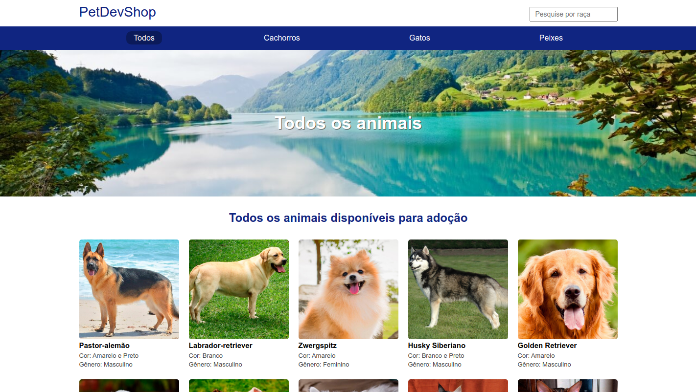
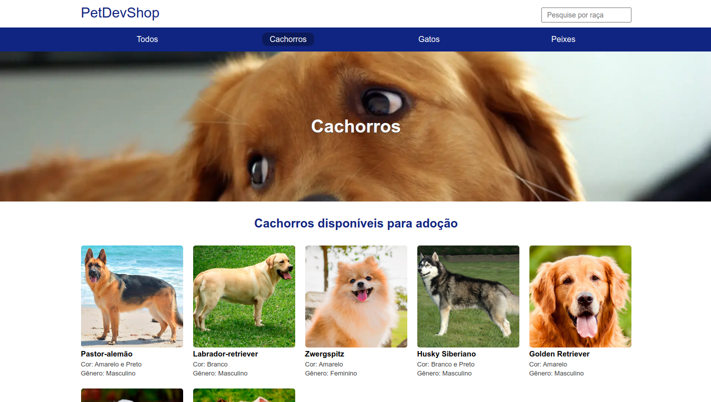
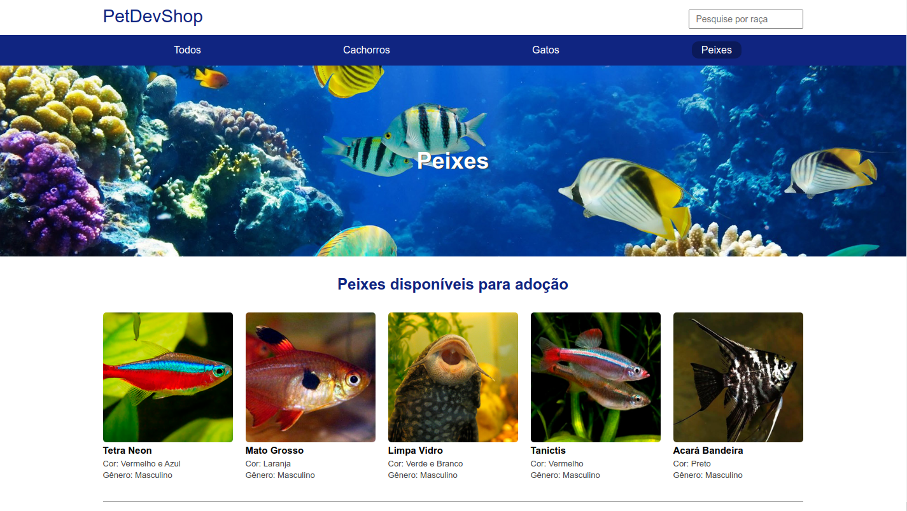
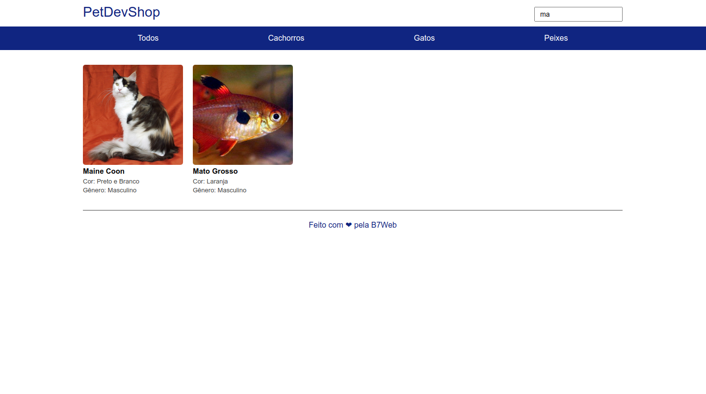
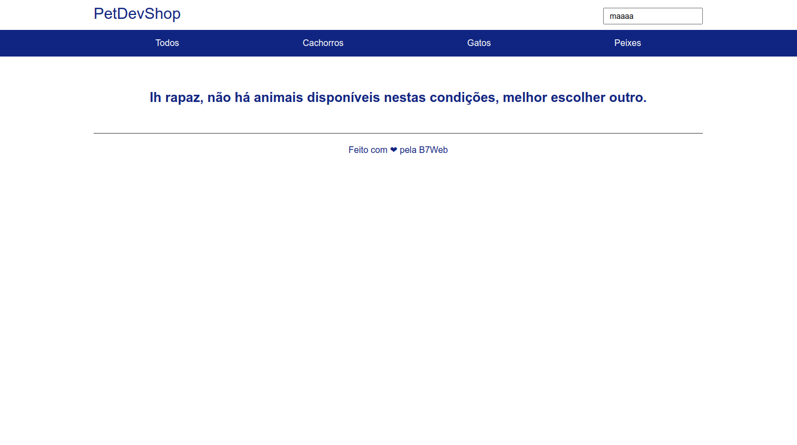

# Canil 🐶​🐱​

## 👀 Como ficou ???

</img>
----------
</img>
----------
</img>
----------
</img>
----------
</img>
----------

## 🧑‍💻 Tecnologias usadas

O projeto foi desenvolvido com as seguintes tecnologias:
- [NodeJs](https://nodejs.org/en/docs/)
- [TypeScript](https://www.typescriptlang.org/)
- [ExpressJs](https://expressjs.com/pt-br/)

## ⌨️ Sobre o projeto

O projeto consiste num website sobre animais, da informações sobre esses animais. O mesmo foi desenvolvido durante o curso da [B7Web](https://b7web.com.br/fullstack/?ref=I24108426I) e com a ajuda do instrutor [Bonieky Lacerda](https://www.instagram.com/bonieky/).

### Pré-requisitos globais
 `npm i -g nodemon typescript ts-node`

### Instalação 
 `npm install`

### Para rodar o projeto
 `npm run start-dev`
